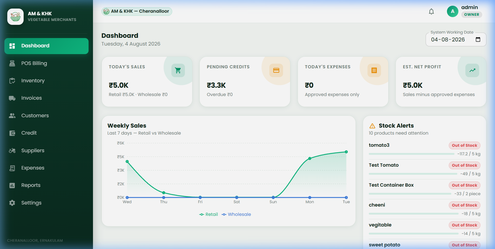
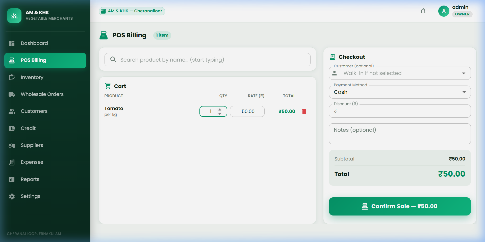
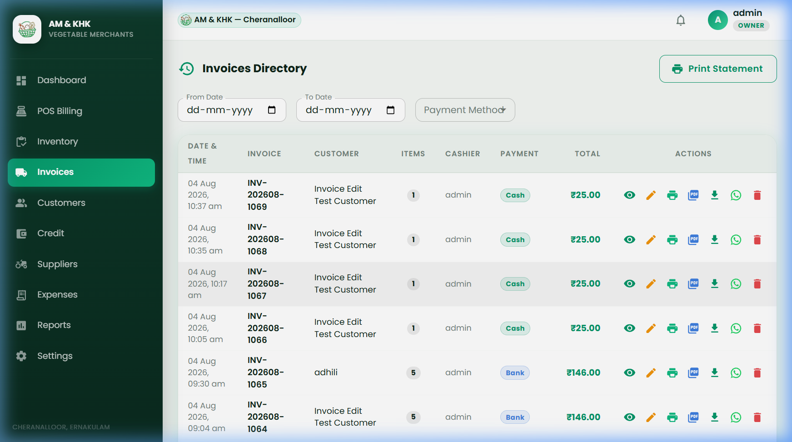
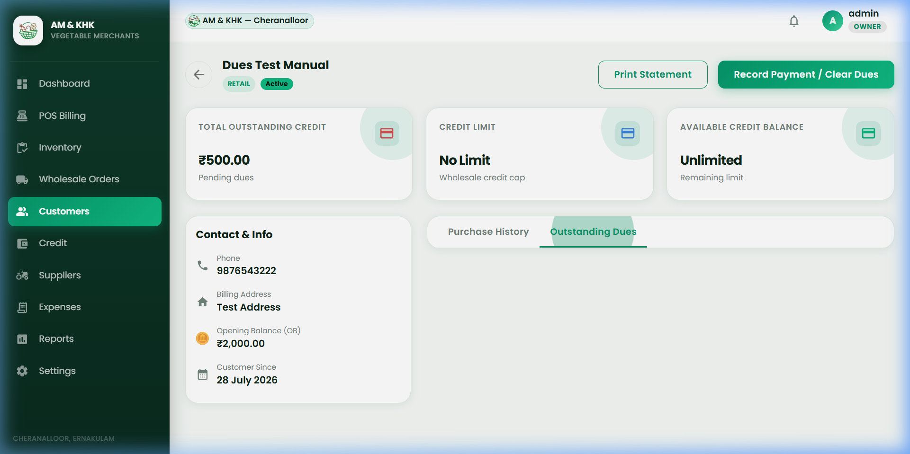
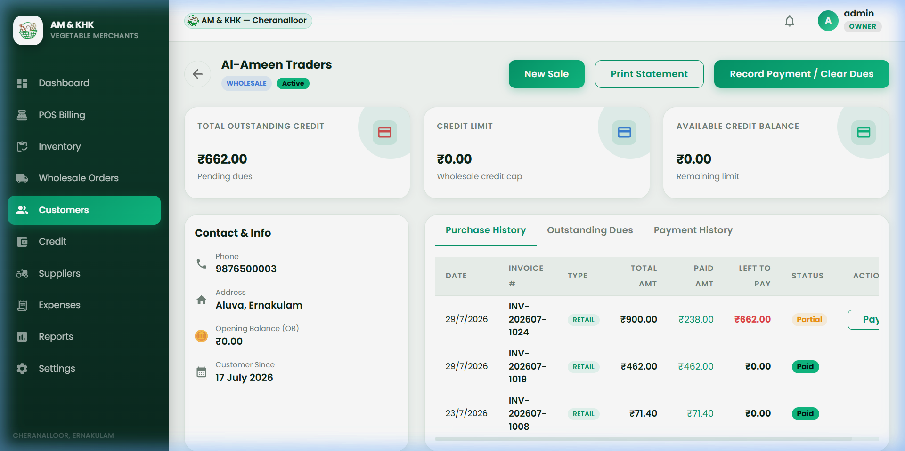

# 🛒 AM & KHK Vegetable Merchants — ERP & POS Management System

[](https://www.python.org/)
[](https://flask.palletsprojects.com/)
[](https://react.dev/)
[](https://mui.com/)
[](https://vitejs.dev/)
[](https://www.sqlite.org/)

An enterprise-grade **Point of Sale (POS) and Enterprise Resource Planning (ERP)** software system built specifically for retail and wholesale vegetable merchants. The system seamlessly handles high-volume billing, credit management, item returns, inventory tracking, supplier purchase orders, thermal receipt printing, and comprehensive financial reporting.

---

## 📸 Screenshots Gallery

### 📊 Dashboard Overview
Real-time sales performance metrics, pending credit dues, daily expense summary, estimated net profit, weekly sales trends chart (Retail vs Wholesale), and instant stock alerts.



---

### 💳 POS Billing & Checkout
Ultra-fast cashier interface supporting walk-in or registered customer billing, custom item discounts, draft holding/recalling, thermal receipt printing, and item returns.



---

### 📦 Inventory & Stock Management
Complete catalog management with stock value computation, unit pricing (kg/bunch/box), supplier linkage, category filtering, and real-time stock status indicators.



---

### 📄 Invoices Directory & History
Comprehensive directory of all generated retail and wholesale invoices with instant PDF downloading, print receipt generation, WhatsApp invoice sharing, and customer payment methods.



---

### 📈 Financial Reports & Statements
Detailed transaction ledgers, daily financial reports, payment account summaries, product sales analytics, and one-click PDF/Excel export.



---

## 🌟 Key Features

- ⚡ **High-Speed POS Billing:** Rapid product search by name or category, fast cart updates, discount input, draft hold/recall, and return processing.
- 🔄 **Flexible Item Returns (Dual-Method):**
  - *In-Cart Return:* Deduct returned items directly during a new POS billing session.
  - *Dedicated Return Billing:* Select existing customer invoices and return items with automatic inventory restocking and credit balance adjustment.
- 💳 **Credit & Dues Management:**
  - Real-time customer outstanding credit balance tracking.
  - Pay against specific past invoices or allocate payment to overall outstanding balance.
- 📦 **Inventory Control & Stock Alerts:**
  - Real-time stock level monitoring with automated low-stock and out-of-stock badges.
  - Stock valuation calculated in exact currency units (paise precision).
- 🚚 **Wholesale & Supplier Purchase Orders (PO):**
  - Supplier dues management, purchase order tracking, partial payment recording, and stock auto-addition on PO fulfillment.
- 🧾 **Thermal Printing & PDF Statements:**
  - ESC/POS thermal printing support (USB / Serial).
  - Pixel-perfect PDF statement generation via WeasyPrint.
- 🔒 **Role-Based Access Control (RBAC):**
  - Server-side enforced access control across 4 roles: **Owner**, **Manager**, **Accountant**, and **Cashier**.

---

## 🛠️ Tech Stack

### **Backend**
- **Framework:** Python 3.11+ / Flask (Blueprints architecture)
- **Database / ORM:** SQLite 3 (`backend/data/amkhk.db`) + SQLAlchemy 2.0 + Alembic
- **Authentication:** Flask-Login session cookies + Bcrypt password hashing
- **PDF & Thermal Printing:** WeasyPrint + python-escpos
- **WSGI Production Server:** Waitress

### **Frontend**
- **Framework:** React 18 + Vite
- **UI System:** Material UI (MUI v5) with customized emerald & dark forest design tokens
- **Data Fetching:** TanStack Query v5 (React Query) + Axios
- **Charts & Data Viz:** Recharts
- **Typography:** Poppins (`@fontsource/poppins`)

---

## 📁 Repository Structure

```
AM & KHK Vegetable Merchants/
├── backend/
│   ├── app/
│   │   ├── models/          # SQLAlchemy Database Models
│   │   ├── routes/          # Flask Blueprints (API Endpoints)
│   │   ├── schemas/         # Data validation & serialization
│   │   ├── services/        # Business logic (Billing, Credit, Inventory)
│   │   ├── utils/           # Auth decorators, currency helpers, printers
│   │   └── templates/       # HTML templates for WeasyPrint PDFs
│   ├── data/                # SQLite database location (git-ignored)
│   └── run.py               # Flask application entry point
├── frontend/
│   ├── src/
│   │   ├── api/             # Axios API client modules
│   │   ├── components/      # Reusable UI components & layouts
│   │   ├── pages/           # Screen views (Dashboard, POS, Inventory, etc.)
│   │   └── theme/           # MUI Theme tokens & palette overrides
│   └── package.json
├── docs/
│   └── screenshots/         # Application screenshot previews
├── deploy_client.bat        # Production client setup script
├── update_client_safe.bat   # Non-destructive client system update script
├── .gitignore               # Security exclusions (DB, env, logs)
├── .env.example             # Environment variable template
└── README.md                # Project documentation
```

---

## 🚀 Getting Started & Local Setup

### Prerequisites
- **Python:** 3.11 or higher
- **Node.js:** v18.0 or higher
- **GTK Runtime (for WeasyPrint PDF generation on Windows):** Included or installed via GTK3 build.

### 1. Backend Setup

1. Navigate to the project root and create a Python virtual environment:
   ```bash
   python -m venv venv
   ```
2. Activate the virtual environment:
   - **Windows:** `venv\Scripts\activate`
   - **Linux/macOS:** `source venv/bin/activate`

3. Install required backend dependencies:
   ```bash
   pip install -r backend/requirements.txt
   ```

4. Create a `.env` file inside `backend/` (or copy from `.env.example`):
   ```ini
   SECRET_KEY=your-secure-random-secret-key
   FLASK_APP=run.py
   FLASK_ENV=development
   ```

5. Run database migrations / initialization:
   ```bash
   python backend/run.py
   ```
   *(Backend starts on `http://localhost:5000` by default)*

---

### 2. Frontend Setup

1. Navigate to the frontend directory:
   ```bash
   cd frontend
   ```

2. Install Node dependencies:
   ```bash
   npm install
   ```

3. Create a `.env` file in `frontend/`:
   ```ini
   VITE_API_BASE_URL=http://localhost:5000
   ```

4. Start the Vite development server:
   ```bash
   npm run dev
   ```
   *(Frontend accessible at `http://localhost:5173`)*

---

## 🔄 Client Machine Deployment & Update Procedure

To update a client machine safely **without losing any operational data** (customers, products, invoices, credit ledger, or credentials):

1. **Do NOT overwrite `backend/data/amkhk.db` or `backend/.env`.**
2. Run the automated safe update script on the client machine:
   ```cmd
   update_client_safe.bat
   ```
3. The script automatically:
   - Pulls the latest production code updates.
   - Runs database migrations seamlessly.
   - Rebuilds the frontend bundle.
   - Restarts the Waitress background service without downtime or data loss.

---

## 🛡️ Security & Data Privacy

To ensure business confidentiality and operational security, the following items are strictly excluded from git tracking via `.gitignore`:
- 🔐 Real security keys, environment secrets, and `.env` files.
- 🗄️ Client production database files (`backend/data/amkhk.db`).
- 📁 Virtual environments (`venv/`, `.venv/`), node dependencies (`node_modules/`), and build output (`dist/`).
- 📝 System log files (`*.log`) and temporary execution scratchpads.

---

## 📄 License & Proprietary Notice

Copyright © 2026 **AM & KHK Vegetable Merchants**. All rights reserved.  
Confidential and Proprietary. Unauthorized copying, distribution, or deployment of this software is strictly prohibited.
